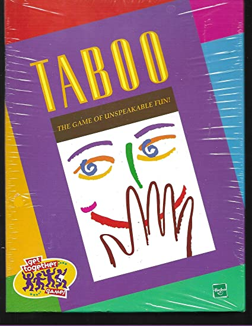
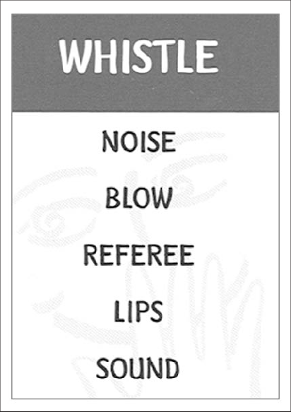
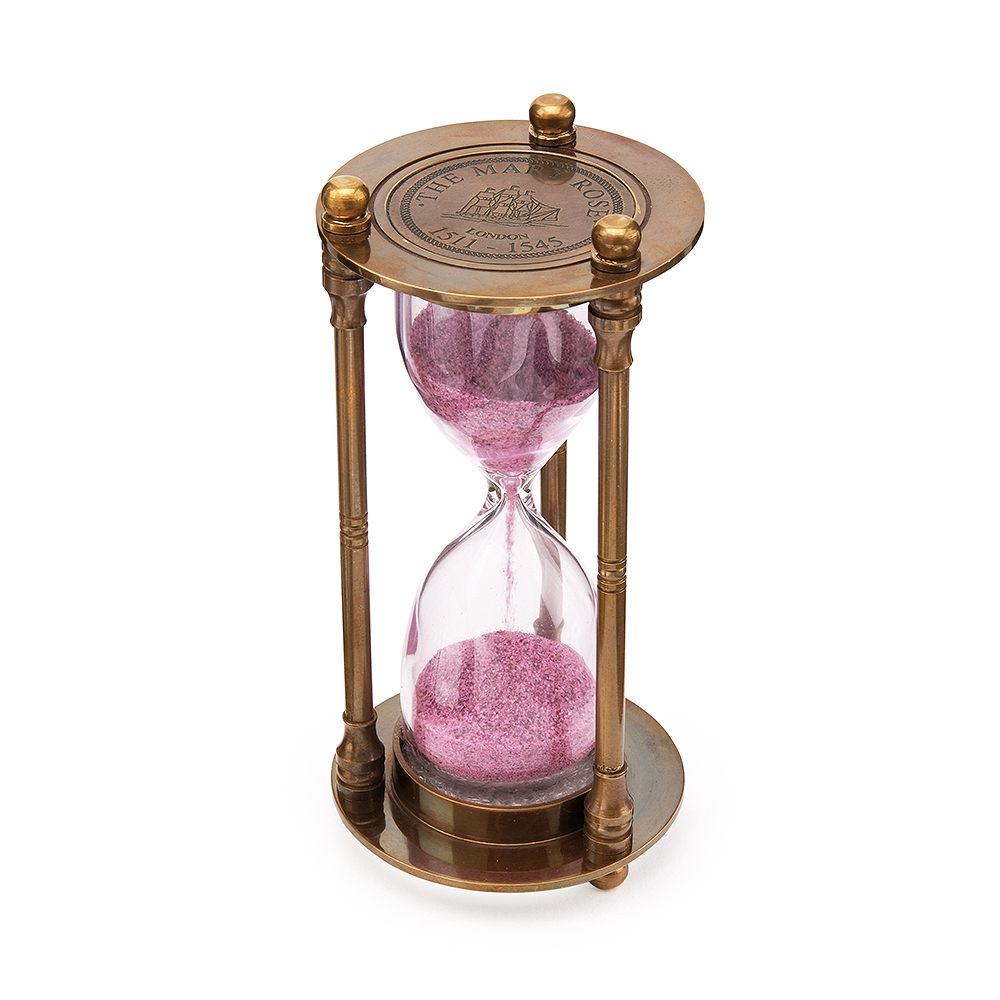
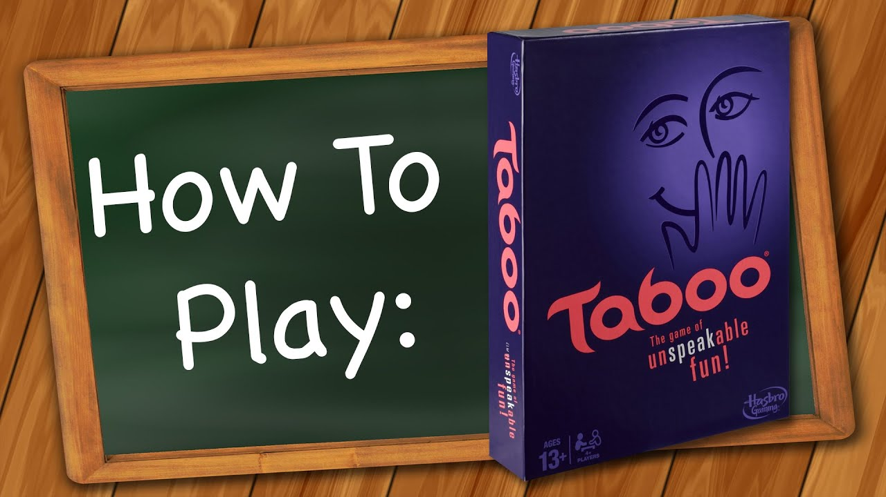
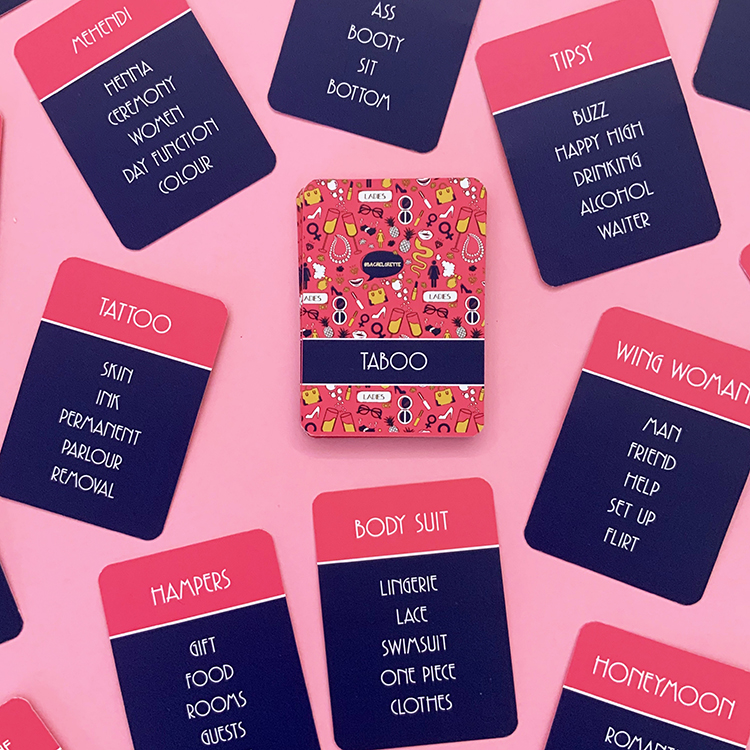

# Offline Taboo mobile game

## Overview
Taboo is a verbal game played with two teams a deck of 502 guess cards with a set of taboo words.

\

## Preparation for the game
The players are divided into two teams:  
 one team is called team A and the other is called team B.  
 502 cards are placed in the card holder. It is the turn of the player from team A. The hint player takes a card containing 5 taboo words, that is, words that cannot be named when explaining just one word written on the card.  
  The game continues until the time runs out.  
Each time a teammate successfully guesses a keyword, a new card is placed on top of the old one, and each card in that pile represents one point for Team A. In the event that a player from the first team says the word “taboo,” a point is awarded to the second team. There comes a change of teams. 

\

## Gameplay and Scoring
In the event that a player answers correctly, the point goes to his team. In the case when a player, prompting his team-mate, names the word taboo, the point goes to the other team. Also, if the player does not cope with this card, he can change it. The previously listed rules are for all teams.

\

## Rules
1. Clue-givers may not use any taboo words, including abbreviations and any part of the taboo word. 
2. Clue-givers may not use sound effects or use gestures to indicate the clue word. 
3. Clue-givers may pass on any card at any time, but the card is then placed in the discard pile.

\

## Scoring
Every card stacked upon another in the card holder represents one point for Team A. Every card stacked in the discard pile represents one point for Team B.  At the end of each round points are tallied for each team, the winner is declared by the team with the most points.
